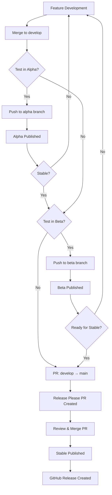

# Release Guide

This document explains how to release packages in the @teispace/npm-packages monorepo.

## Table of Contents

- [Release Channels](#release-channels)
- [Version Strategy](#version-strategy)
- [Alpha Releases](#alpha-releases)
- [Beta Releases](#beta-releases)
- [Stable Releases](#stable-releases)
- [Hotfix Releases](#hotfix-releases)
- [Release Workflow](#release-workflow)
- [Troubleshooting](#troubleshooting)

## Release Channels

We maintain three release channels for different stages of stability:

| Channel    | npm Tag   | Branch  | Stability   | Use Case                               |
| ---------- | --------- | ------- | ----------- | -------------------------------------- |
| **Alpha**  | `@alpha`  | `alpha` | Unstable    | Experimental features, rapid iteration |
| **Beta**   | `@beta`   | `beta`  | Pre-release | Feature complete, testing phase        |
| **Stable** | `@latest` | `main`  | Stable      | Production-ready releases              |

### Installing Different Channels

```bash
# Stable (default)
npm install @teispace/next-maker

# Alpha (experimental)
npm install @teispace/next-maker@alpha

# Beta (pre-release)
npm install @teispace/next-maker@beta

# Specific version
npm install @teispace/next-maker@1.2.3
```

## Version Strategy

We follow **Semantic Versioning (SemVer)**: `MAJOR.MINOR.PATCH`

- **MAJOR**: Breaking changes (1.0.0 → 2.0.0)
- **MINOR**: New features, backward compatible (1.0.0 → 1.1.0)
- **PATCH**: Bug fixes, backward compatible (1.0.0 → 1.0.1)

### Pre-release Identifiers

- **Alpha**: `1.2.3-alpha.20241127120000`
- **Beta**: `1.2.3-beta.20241127120000`

## Alpha Releases

Alpha releases are for experimental features and rapid development.

### When to Use Alpha

- Testing new experimental features
- Breaking changes in development
- Rapid iteration on new functionality
- Internal testing before beta

### Creating an Alpha Release

#### Option 1: Direct Push (Automated)

```bash
# Ensure you're on develop branch
git checkout develop

# Create and push to alpha branch
git checkout -b alpha
git push origin alpha

# Or update existing alpha branch
git checkout alpha
git merge develop
git push origin alpha
```

**What Happens:**

1. GitHub Actions workflow triggers
2. Builds all packages
3. Automatically versions packages with timestamp: `0.0.1-alpha.20241127120000`
4. Publishes to npm with `@alpha` tag
5. Creates git tag

#### Option 2: Manual Version (Advanced)

```bash
# Checkout alpha branch
git checkout alpha

# Manually set version
yarn workspaces foreach -A --no-private exec \
  npm version prerelease --preid=alpha --no-git-tag-version

# Commit and push
git add .
git commit -m "chore: release alpha version"
git push origin alpha
```

### Alpha Version Example

```
Before: 0.0.1
After:  0.0.1-alpha.20241127120000
```

## Beta Releases

Beta releases are feature-complete versions ready for broader testing.

### When to Use Beta

- Feature complete, needs testing
- Release candidate before stable
- Testing with early adopters
- Final validation before production

### Creating a Beta Release

#### Option 1: Direct Push (Automated)

```bash
# Ensure features are ready on develop
git checkout develop

# Create or update beta branch
git checkout -b beta
git push origin beta

# Or update existing beta branch
git checkout beta
git merge develop
git push origin beta
```

**What Happens:**

1. GitHub Actions workflow triggers
2. Builds all packages
3. Automatically versions packages: `0.0.1-beta.20241127120000`
4. Publishes to npm with `@beta` tag
5. Creates git tag

#### Option 2: From Alpha (Promotion)

```bash
# If alpha is stable enough, promote to beta
git checkout beta
git merge alpha
git push origin beta
```

### Beta Version Example

```
Before: 0.0.1
After:  0.0.1-beta.20241127120000
```

## Stable Releases

Stable releases are production-ready versions managed by **Release Please**.

### When to Release Stable

- All features tested in beta
- No known critical bugs
- Documentation complete
- Ready for production use

### Creating a Stable Release

Stable releases are **fully automated** using Release Please:

#### Step 1: Merge Features to Develop

```bash
# All features should be merged to develop first
git checkout develop
git pull origin develop

# Ensure everything works
yarn validate
yarn build
```

#### Step 2: Create Release PR

```bash
# Create PR from develop to main
git checkout -b release/prepare-v1.0.0
git push origin release/prepare-v1.0.0

# Open PR on GitHub: develop → main
```

#### Step 3: Wait for Release Please

**Release Please** will automatically:

1. Create/update a Release PR
2. Generate CHANGELOG.md
3. Calculate next version based on commits
4. Update package versions

**The Release PR includes:**

- Auto-generated changelog
- Version bumps
- All commits since last release

#### Step 4: Review and Merge

1. Review the Release PR
2. Check changelog accuracy
3. Verify version bumps
4. Approve and merge PR

#### Step 5: Automatic Publishing

**After merge, GitHub Actions will:**

1. Build all packages
2. Run tests
3. Publish to npm with `@latest` tag
4. Create GitHub Release
5. Generate release notes

### Version Calculation

Release Please determines version based on commits:

```bash
# Patch release (0.0.1 → 0.0.2)
fix: resolve bug

# Minor release (0.0.1 → 0.1.0)
feat: add new feature

# Major release (0.0.1 → 1.0.0)
feat!: breaking change

# or
feat: add feature

BREAKING CHANGE: This changes the API
```

## Hotfix Releases

For urgent production fixes.

### Creating a Hotfix

```bash
# Create hotfix branch from main
git checkout main
git pull origin main
git checkout -b hotfix/critical-bug

# Fix the bug
# ... make changes ...

# Commit with fix type
git add .
git commit -m "fix: resolve critical security issue"

# Push and create PR to main
git push origin hotfix/critical-bug

# After merge to main, also merge to develop
git checkout develop
git merge hotfix/critical-bug
git push origin develop
```

**Release Please** will handle versioning automatically.

## Release Workflow

### Complete Release Flow



### Typical Development Cycle

1. **Development Phase**
   - Feature branches → `develop`
   - Regular commits with conventional format

2. **Alpha Testing** (Optional)
   - `develop` → `alpha`
   - Rapid iteration
   - Internal testing

3. **Beta Testing** (Optional)
   - `alpha` or `develop` → `beta`
   - Broader testing
   - Release candidate

4. **Stable Release**
   - `develop` → `main` (via PR)
   - Release Please automation
   - Production deployment

## Package-Specific Releases

For monorepos with multiple packages:

### Release Individual Package

Release Please handles this automatically. If only one package changed:

```bash
# Only commits affecting packages/next-maker
feat(next-maker): add new feature

# Results in:
# - Only next-maker version bumped
# - Only next-maker published
# - Tag: next-maker-v1.0.0
```

### Release Multiple Packages

```bash
# Commits affecting multiple packages
feat(next-maker): add feature A
feat(another-package): add feature B

# Results in:
# - Both packages version bumped
# - Both packages published
# - Multiple tags created
```

## GitHub Secrets Setup

Required secrets in GitHub repository settings:

### NPM_TOKEN

1. Generate npm token:

   ```bash
   npm login
   npm token create --type=automation
   ```

2. Add to GitHub:
   - Go to: `Settings` → `Secrets and variables` → `Actions`
   - Click: `New repository secret`
   - Name: `NPM_TOKEN`
   - Value: Your npm automation token

### GITHUB_TOKEN

- Automatically provided by GitHub Actions
- No setup required

## Troubleshooting

### Release Please PR Not Created

**Causes:**

- No conventional commits since last release
- Commits don't trigger version bump
- Release Please config incorrect

**Solutions:**

```bash
# Check commit messages
git log --oneline

# Ensure commits follow conventional format
git commit --amend -m "feat: proper conventional commit"

# Push and wait for Release Please
```

### npm Publish Failed

**Causes:**

- NPM_TOKEN expired or invalid
- Package name already taken
- Version already published

**Solutions:**

```bash
# Check npm token
npm whoami

# Regenerate token if needed
npm token create --type=automation

# Update GitHub secret
```

### Version Conflict

**Causes:**

- Local version doesn't match remote
- Manual version changes conflict

**Solutions:**

```bash
# Reset to remote
git fetch origin
git reset --hard origin/main

# Let Release Please handle versions
```

### Failed CI Checks

**Causes:**

- Linting errors
- Type errors
- Build failures
- Test failures

**Solutions:**

```bash
# Run all checks locally
yarn validate
yarn test
yarn build

# Fix all issues before pushing
```

## Best Practices

### ✅ Do's

- ✅ Use conventional commits
- ✅ Test in alpha/beta before stable
- ✅ Review Release Please PRs carefully
- ✅ Keep CHANGELOG.md updated (auto-generated)
- ✅ Document breaking changes
- ✅ Use proper semantic versioning

### ❌ Don'ts

- ❌ Don't manually edit package versions
- ❌ Don't skip alpha/beta for major changes
- ❌ Don't force push to protected branches
- ❌ Don't merge without CI passing
- ❌ Don't release on Friday (unless emergency)
- ❌ Don't release without testing

## Release Checklist

### Before Release

- [ ] All tests passing
- [ ] Documentation updated
- [ ] CHANGELOG reviewed
- [ ] Breaking changes documented
- [ ] Migration guide (if needed)
- [ ] Dependencies updated
- [ ] Security vulnerabilities checked

### After Release

- [ ] Verify npm package published
- [ ] Test installation from npm
- [ ] Announcement prepared
- [ ] Documentation deployed
- [ ] GitHub release notes reviewed
- [ ] Monitor for issues

## Questions?

- Check [CONTRIBUTING.md](./CONTRIBUTING.md)
- Open an [issue](https://github.com/teispace/npm-packages/issues)
- Ask in [discussions](https://github.com/teispace/npm-packages/discussions)
